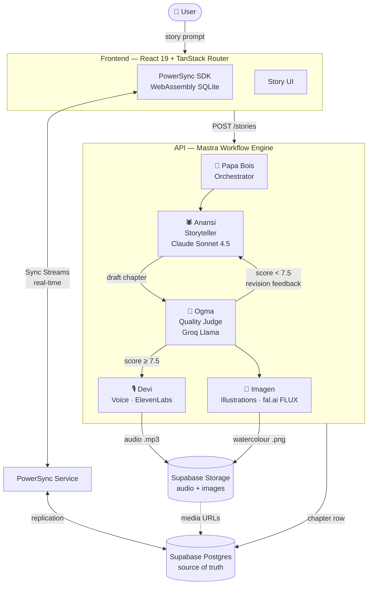

# SandSync 🌴

> **Where Stories Live Offline and Breathe Online**

An offline-first AI storytelling platform powered by Caribbean folklore. Five mythological spirits — implemented as real AI agents — collaborate asynchronously to write, narrate, illustrate, and sync living stories to every connected device. Even without internet.

Built for the **PowerSync AI Hackathon 2026** by **Nissan Dookeran** · Redditech Pty Ltd · Sydney, Australia.

---

## 🌐 Live Demo

| | URL |
|---|---|
| 🎭 Frontend | **https://web-eta-black-15.vercel.app** |
| 🔁 Pipeline Demo | **https://web-eta-black-15.vercel.app/pipeline-demo** |
| ⚙️ API | **https://sandsync-api.fly.dev** |
| 📦 Repository | **https://github.com/reddinft/sandsync** |

---

## 🎯 Why SandSync Exists

Caribbean and West African oral traditions are disappearing — fragmented across inaccessible archives, disconnected from the communities they belong to. Every AI storytelling tool on the market requires a live internet connection, making it useless in rural communities, remote schools, and low-bandwidth regions.

**SandSync is the answer:** a platform where stories begin offline, survive offline, and seamlessly rejoin the digital world when connectivity returns.

- A child in Trinidad reads a Papa Bois story on a tablet. The internet drops. **The story keeps loading.**
- She saves her favourite chapter. **Persisted locally in SQLite via PowerSync.**
- Signal returns. **PowerSync syncs her session to every device in the classroom — instantly, without her touching anything.**

This isn't a workaround. This is the architecture. **Offline-first by design, not by accident.**

---

## 🏗️ Architecture



> See [ARCHITECTURE.md](./ARCHITECTURE.md) for the full data flow, offline scenario walkthrough, and agent pipeline detail.

---

## 🤖 The Five Agents

Each agent's technical role mirrors its mythological identity. The casting is intentional.

| Agent | Mythology | Model | Role |
|---|---|---|---|
| **Papa Bois** 🌳 | Trinidad forest guardian — protects and routes | Claude Sonnet 4.5 | Orchestrator. Generates creative brief: title, genre, mood, folklore elements. Routes to Anansi. |
| **Anansi** 🕷️ | West African/Caribbean spider, keeper of all stories | Claude Sonnet 4.5 | Storyteller. Writes chapters with Caribbean dialect. Accepts Ogma's feedback and revises (up to 3 attempts). |
| **Ogma** 📜 | Celtic god of eloquent speech | Groq Llama | Quality judge. LLM-as-judge scoring 0–10. Rejects below 7.5 with structured feedback bullets. |
| **Devi** 🎙️ | Sanskrit voice goddess | ElevenLabs TTS | Narration. Generates audio per chapter with Anansi's voice (`SOYHLrjzK2X1ezoPC6cr`). Uploads to Supabase Storage. |
| **Imagen** 🎨 | Visual artist | fal.ai FLUX Schnell | Illustration. Generates watercolour-style Caribbean scene per chapter. Uploads to Supabase Storage. |

### Quality Gate: The Ogma Loop

```
Anansi writes chapter draft
         │
         ▼
  Ogma scores 0–10
         │
    ┌────┴────┐
   < 7.5    ≥ 7.5
    │          │
    ▼          ▼
 Revision   Approve → Devi + Imagen run in parallel
 feedback
    │
    ▼
 Anansi revises (max 3 attempts, then force-approve)
```

Ogma returns structured `rejection_reason` bullets that Anansi incorporates into the next draft. This LLM-as-judge pattern ensures cultural authenticity and narrative quality before any chapter reaches the user.

---

## 🔁 PowerSync: Offline-First by Design

PowerSync is the **engine**, not an afterthought. Remove it and the product ceases to exist.

### How It Works

```
┌─────────────────────────────────────────────────────────────┐
│                  SANDSYNC SYNC ARCHITECTURE                 │
│                                                             │
│  [React Frontend + TanStack Router]                         │
│       │                                                     │
│       ▼                                                     │
│  [PowerSync SDK]  ←──── Sync Streams (real-time push) ──┐  │
│       │                                                  │  │
│       ▼                                                  │  │
│  [Local SQLite DB]              [PowerSync Service]      │  │
│  stories table                        │                  │  │
│  story_chapters table          ┌──────┘                  │  │
│  agent_events table            ▼                         │  │
│  (offline reads ✅)    [Supabase Postgres + RLS]─────────┘  │
│  (local writes ✅)     (source of truth + auth)             │
└─────────────────────────────────────────────────────────────┘
```

### Local Schema (3 tables synced to browser SQLite)

```typescript
// apps/web/app/lib/powersync.ts
const appSchema = new Schema({
  stories: new Table({ /* title, genre, theme, status, user_id */ }),
  story_chapters: new Table({ /* story_id, chapter_number, content, audio_url, image_url */ }),
  agent_events: new Table({ /* story_id, agent, event_type, payload */ }),
});
```

### Offline Scenario

| Step | What Happens |
|---|---|
| 🔌 Network drops | PowerSync local SQLite serves full story library — no spinner |
| 📖 User reads | Chapters load from local SQLite — zero network dependency |
| 💾 User saves annotation | Written to local SQLite immediately — no network call |
| 📶 Network restored | PowerSync Sync Streams replay queued writes to Supabase |
| 🔄 Other devices | Receive updates via Sync Streams — automatic, no manual refresh |

**Local SQLite is the primary data layer.** Supabase is the sync target, not the read source.

---

## 🛠️ Tech Stack

| Layer | Technology | Version | Role |
|---|---|---|---|
| **Sync Engine** | [PowerSync](https://www.powersync.com) | SDK ^1.35.0 | Offline-first SQLite sync + Sync Streams |
| **Backend DB** | [Supabase](https://supabase.com) Postgres | ^2.98.0 | Source of truth, RLS auth, media storage |
| **Agent Orchestration** | [Mastra](https://mastra.ai) | ^1.10.0 | Multi-agent workflow, Papa Bois conductor |
| **Frontend Router** | [TanStack Router](https://tanstack.com/router) | ^1.166.3 | Type-safe SPA routing, pipeline-demo page |
| **Storyteller AI** | [Anthropic](https://anthropic.com) Claude Sonnet 4.5 | @ai-sdk/anthropic | Papa Bois brief + Anansi story writing |
| **Quality Judge AI** | [Groq](https://groq.com) Llama | @ai-sdk/groq | Ogma LLM-as-judge |
| **Image Generation** | [fal.ai](https://fal.ai) FLUX Schnell | ^1.9.4 | Imagen watercolour illustrations |
| **Voice Narration** | [ElevenLabs](https://elevenlabs.io) TTS | REST API | Devi chapter audio |
| **Speech-to-Text** | [Deepgram](https://deepgram.com) | REST API | Voice prompt input |
| **Frontend Framework** | React 19 + Tailwind CSS 4 | — | UI |
| **Deployment** | Vercel (web) + Fly.io (API) | — | Infrastructure |

---

## 🏆 Hackathon Prize Targets

| Prize | Value | How SandSync Qualifies |
|---|---|---|
| 🥇 **Main Prize** | TBD | PowerSync is architectural — Sync Streams power real-time chapter delivery; local SQLite is primary data layer |
| 🥇 **Best Local-First** | $500 | Full offline story reads; local writes queued and replayed; documented offline → reconnect scenario |
| 🥇 **Best Supabase** | $1,000 credits | Postgres source of truth + RLS + Supabase Storage for audio/images |
| 🥇 **Best Mastra** | $500 gift card | All 5 agents orchestrated via Mastra workflows; Papa Bois ↔ Anansi ↔ Ogma handoffs use native Mastra primitives |
| 🥇 **Best TanStack** | Tanner 1:1 + swag | TanStack **Router** (not just Query) powers the SPA; type-safe route definitions throughout |

---

## 🌴 Sponsor Integrations

### PowerSync
Core sync engine. The PowerSync SDK (WebAssembly) runs in the browser, maintaining a local SQLite database. Sync Streams push real-time updates from Supabase to every connected client as each story chapter is completed. The local SQLite is the **read layer** — not a cache.

### Supabase
Three roles: (1) **Postgres** is the cloud source of truth, (2) **RLS policies** enforce per-user story access, (3) **Supabase Storage** hosts generated audio files (`.mp3` from ElevenLabs) and illustration images (`.png` from fal.ai FLUX).

### Mastra
All agent-to-agent handoffs use Mastra's native workflow primitives. Papa Bois is a Mastra orchestrator step; Anansi and Ogma run in a retry loop managed by Mastra's workflow state machine; Devi and Imagen run as parallel Mastra steps post-approval.

### TanStack Router
Powers the full React SPA with type-safe route definitions. The `/pipeline-demo` page is a dedicated TanStack route that shows live agent progress via PowerSync-backed reactive queries.

### ElevenLabs
Devi agent calls ElevenLabs TTS with voice ID `SOYHLrjzK2X1ezoPC6cr` (Anansi's voice) for each approved chapter. Audio files are uploaded to Supabase Storage and the URL is written to the `story_chapters.audio_url` column — synced to clients via PowerSync.

### fal.ai
Imagen agent calls fal.ai FLUX Schnell to generate watercolour-style Caribbean illustrations. Images are uploaded to Supabase Storage; URLs written to `story_chapters.image_url` and synced via PowerSync.

### Deepgram
Voice input support: user can speak their story prompt. Deepgram REST API transcribes the audio to text before routing to the agent pipeline.

### Groq
Powers Ogma's LLM-as-judge evaluation using Groq Llama for fast, low-latency quality scoring. Groq's inference speed means the quality gate adds minimal latency to the pipeline.

---

## 🚀 Running Locally

### Prerequisites
- [Bun](https://bun.sh) >= 1.1
- [Supabase CLI](https://supabase.com/docs/guides/cli)
- API keys: Anthropic, Groq, ElevenLabs, fal.ai, Deepgram
- PowerSync account + project token

### Setup

```bash
# Clone and install
git clone https://github.com/reddinft/sandsync
cd sandsync
bun install

# Start local Supabase (runs Postgres + Storage locally)
supabase start

# Copy env files and fill in your keys
cp apps/api/.env.example apps/api/.env
cp apps/web/.env.example apps/web/.env
```

### Environment Variables

**`apps/api/.env`**
```env
SUPABASE_URL=http://127.0.0.1:54321
SUPABASE_SERVICE_ROLE_KEY=<from supabase start output>
ANTHROPIC_API_KEY=sk-ant-...
GROQ_API_KEY=gsk_...
ELEVENLABS_API_KEY=...
FAL_KEY=...
DEEPGRAM_API_KEY=...
```

**`apps/web/.env`**
```env
VITE_SUPABASE_URL=http://127.0.0.1:54321
VITE_SUPABASE_ANON_KEY=<from supabase start output>
VITE_POWERSYNC_URL=<your PowerSync project URL>
VITE_POWERSYNC_TOKEN=<your PowerSync token>
```

### Start Dev Servers

```bash
# Run API + web in parallel
bun dev
```

- Frontend: http://localhost:3000
- API: http://localhost:4111
- Supabase Studio: http://localhost:54323

---

## 📁 Monorepo Structure

```
sandsync/
├── apps/
│   ├── web/                        # React 19 + TanStack Router frontend
│   │   └── app/lib/powersync.ts    # PowerSync schema (3 tables)
│   └── api/                        # Mastra agent backend
│       └── src/mastra/
│           ├── agents/             # Papa Bois, Anansi, Ogma definitions
│           ├── workflows/
│           │   └── story-pipeline.ts  # Main Mastra workflow
│           └── index.ts
├── packages/
│   └── db/                         # Shared Supabase types + schema
├── supabase/
│   ├── migrations/                 # SQL schema files
│   └── config.toml
└── ARCHITECTURE.md                 # Full technical architecture doc
```

---

## 🌍 Cultural Authenticity

SandSync is built by the culture, for the culture. **Nissan Dookeran** is a Trinidad-heritage developer. The agent names aren't a theme — they're an identity:

- **Papa Bois** is the Trinidad forest guardian. Forest guardians protect and route. He is the orchestrator.
- **Anansi** is the West African/Caribbean spider deity, keeper of all stories. He is the storyteller.
- **Ogma** is the Celtic god of eloquent speech. Language gods review language.
- **Devi** is the Sanskrit voice goddess. She gives the story its voice.
- **Imagen** brings the visual world to life.

> *"We didn't name an AI agent after Papa Bois. We built Papa Bois as an AI agent."*

---

*Built with 🌴 by Nissan Dookeran · Redditech Pty Ltd · Sydney, Australia*
*PowerSync AI Hackathon 2026 · Deadline: March 20, 2026*
